<!-- Header -->

  
  
  

Passionate web developer from China building modern, performant web applications. I love open source, clean code, and turning ideas into reality.

---

### About Me

- Building polished web apps with **React**, **Next.js**, and **TypeScript**
- Diving into **Web3** — built [IntentSwap](https://intentswap.zyang.space/), a decentralized intent-based token swap dApp
- Maintaining open-source [Next.js Starter Template with Paddle](https://github.com/yzy98/nextjs-starter-template-paddle)
- Exploring all my projects on [zyang.space/projects](https://zyang.space/projects/)

---

### Featured Projects

<table>
  <tr>
    <td width="50%" valign="top">
      <h3 align="center">IntentSwap</h3>
      

        
      

      
A decentralized crypto dApp enabling intent-based token swaps with smart contract settlement on-chain.

    </td>
    <td width="50%" valign="top">
      <h3 align="center">Next.js Starter Template</h3>
      

        
      

      
A production-ready Next.js starter template with Paddle integration for SaaS projects. Open source and community-driven.

    </td>
  </tr>
  <tr>
    <td width="50%" valign="top">
      <h3 align="center">YouTube Comments Chat</h3>
      

        
      

      
An interactive tool that transforms YouTube comment sections into a chat-like conversational experience.

    </td>
    <td width="50%" valign="top">
      <h3 align="center">More Projects</h3>
      

        
      

      
Check out my full portfolio for more work, experiments, and side projects.

    </td>
  </tr>
</table>

---

### Tech Stack

**Languages**

**Frameworks & Libraries**

**Backend & Database**

**Web3**

**Tools & DevOps**

---

### GitHub Stats

  
  

